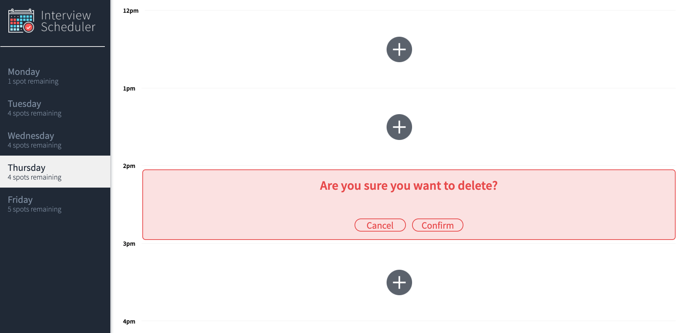

# Interview Scheduler

## Project Description

Interview Schedule is a Single Page Application used for booking student interviews. Using React's built-in hooks, as well as custom hooks, users are able to book, edit and delete reservations in real time. Persistent data is available through an API server using a PostgreSQL database. Unit, integration, and End-to-End testing is performed to ensure all components are working as expected. 

## Project Features
* Days are shown with colors dependent on availability
  * Number of aviailable slots is shown under each day
* A user can switch between days to see detailed information regarding the slots that are open
  * Book slots are easily distinguishable from available slots 
* Easily book or edit your interview by typing in your name and choosing an interviewer
* Easily delete your interview using our delete icon that shows during hover over your appointment 
  * This works for Editing as well
* Confirmation message appears when doing a destructive action to ensure nothing is done by mistake


### Daily View 

<i>Daily view on Home Page</i>

### Booking

<i>View when creating a booking</i>

### Hover


<i>Red Background indicated Day being Hovered over</i>

### Confirmation

<i>Confirmation when executing a destructive action</i>

### Spots Filled 


<i>When spots are filled, we see the day muted</i>

## Setup

Install dependencies with `npm install`.

## Running Webpack Development Server

```sh
npm start
```

## Running Jest Test Framework

```sh
npm test
```

## Running Storybook Visual Testbed

```sh
npm run storybook
```

## Dependencies

* Axios
* Classnames
* normalize.css
* react
* react-dom
* react-scripts